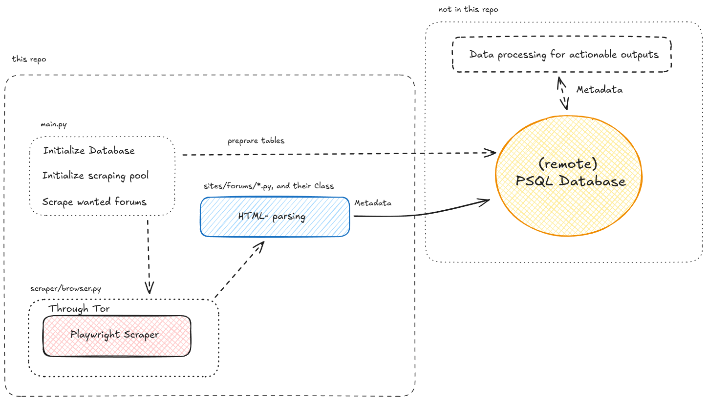

# Forum Scrapers
Tor-powered web scraping tool for continuous monitoring of cybercrime forums.

## Overview
Python-based scraping tool designed to monitor and collect near-realtime data from cybercrime forums. The app uses Tor for anonymity, PostgreSQL for data storage, and Playwright for web scraping to continuously track forum posts and activity.

## Usage:

### Bring your own PSQL
Modify the PostgreSQL database URL to your own in .env.md as PSQL_URL, and save the file as .env

### Modify the config file
Add the Breachforums (Shiny Hunters), and Breachforums (HasanBroker 16/1/2026) links into config.toml. 

### Running the program
Then run:
```sh
pip install -r requirements.txt
python3 main.py
```

Tip: use screen for continued scraping.

## Description

This projects aims for a modular framework to scrape cybercrime forums with the following features:

- **Tor Integration**: Routes all traffic through Tor for enhanced anonymity.
- **Database Storage**: Uses PostgreSQL to store scraped post data.
- **Modular Scrapers**: Supports multiple forum types through a plugin-like architecture
- **Continuous Monitoring**: Runs the scrapers at a configurable interval (default 5 minutes)
- **Dynamic Configuration**: TOML-based configuration for easy setup

Plug and play database: The system will automatically create database tables for forum tracking and stores scraped posts with metadata (title, content, timestamp, and source forum identification).

